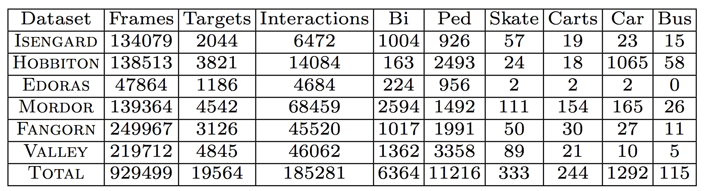
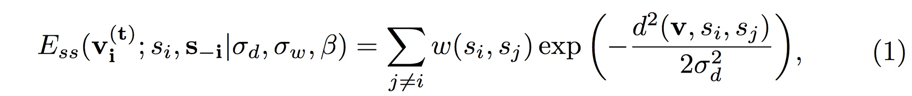
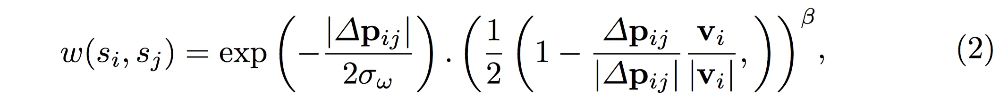
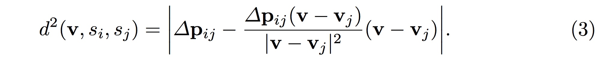
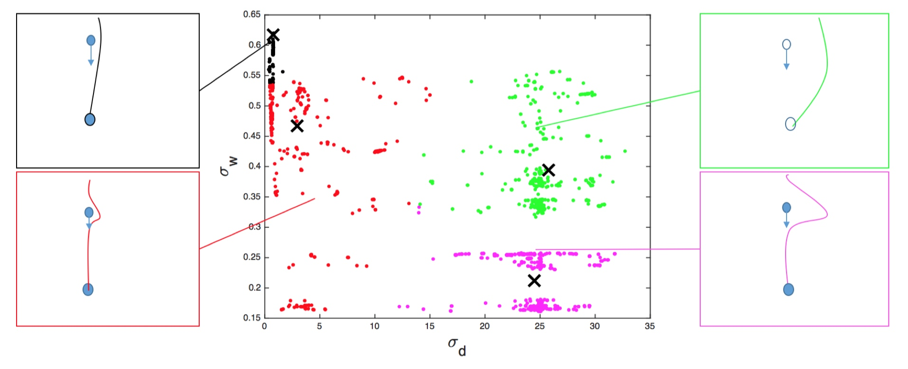
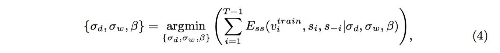
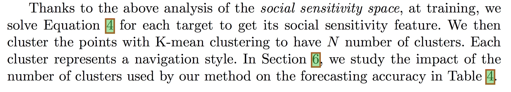
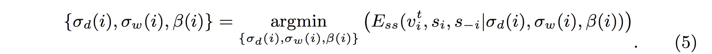
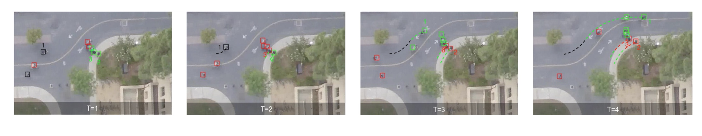
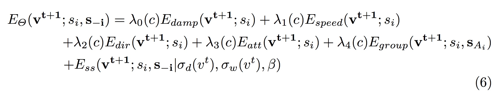

# [Learning Social Etiquette:Human Trajectory Understanding in Crowded Scenes](https://infoscience.epfl.ch/record/230262/files/ECCV16social.pdf)
* 论文发表在ECCV2016上，引用31次。

* 公布了一个大型数据集(包含了各种目标，人、自行车、公交车...)(http://cvgl.stanford.edu/projects/uav_data/)。 包含了100多种不同的场景，20000个目标。包含了大量的 target-target interaction(185K) 和 target-space interaction(40K).
  如上图所示，数据采集场景被划分为了6个部分。
*  Modeling Social Sensitivity
   通过能量势能(energy potential)建模对象之间的相互作用，高的能量势能表明更敏感。
   在每一个时刻 t, 第 i 个对象的状态表示为 $s_i^{(t)}=\{p_i^{(t)},v_i^{(t)}\}$. 分别代表位置和速度(矢量)。建模social sensitivity 的能量势能定义如下：
其中，$w(s_i, s_j)$和$d^2(v, s_i, s_j)$ 分别定义为

上面的式子是从 [You'll never walk alone](http://vision.cse.psu.edu/courses/Tracking/vlpr12/PellegriniNeverWalkAlone.pdf)中拿过来的。在原来的文章里，$E_{ss}$用来衡量人与人之间交互产生的能量势能。
本文定义参数$\Theta_{ss}=\{\sigma_d,\sigma_w,\beta\}$作为社交敏感度特征(social sensitivity feature)。它们描绘了对象之间是如何避免碰撞的，其中：

    > $\sigma_d$ is the preferred distance a target maintains to avoid collision.
    > $\sigma_{w}$ is the distance at which a target reacts to prevent a collision(distance at which he starts deviating from its linear trajectory).
    > $\beta$ controls the peakiness of the weighting function. 
 
    这里的两个参数,一个表示行人之间开始受影响的距离,一个表示必须要采取措施避免碰撞的距离。

    ## Training：
     由于不同的对象在不同的环境下，可能存在不同的导航模式(navigation style)。如下图所示：
    上图中间表示了4中不同的 navigation style(图中四种不同的颜色)，图中的每个点代表一个对象。横轴表示$\sigma_d$，纵轴表示$\sigma_w$。可以看到，右上角绿色的行人很远就开始改变方向(mild behavior)；而左下角红色的人知道要碰撞之前才开始改变防线(aggressive behavior)。 
从上可知，对所有行人都使用一组参数$\Theta_{ss}$不能够刻画运动模式。本文采用的方法是，在训练过程中，对每一个对象解如下方程：
得到其 social sensitivity feature. 然后做 k-means 聚类，每一种类别代表一种导航模式。(这里我不知道他是如何对每一个对象求式4的，因为要同时求出三个未知数)
在测试阶段，对研究对象i 求下式最小：
然后得出了$\Theta_{ss}(i)=\{\theta_d(i),\theta_w(i),\beta(i)\}$.将其分配到训练阶段得到的某个类中去，就得到了对象i 所属的导航模式。
论文也讨论了，对象在运动过程中，随着周围环境的变化，其导航模式也可能发生变化(这个变化与其物理类型无关).
上面的四个图分别代表了四个时刻，同一种颜色代表了同一种 navigation style。
    ### 预测行人的轨迹：
    给定观测对象过去 t 个时刻的轨迹，希望预测未来 N 个时刻的位置。
    对于每一个对象来说，其能量函数定义为：
    上式来自who are you with and where are you going(CVPR2011)。$\Theta=\{\lambda_0(c),\lambda_1(c),\lambda_2(c),\lambda_3(c),\lambda_4(c),\sigma_d(v^t),\sigma_w(v^t),\beta\}$, c 代表navigation style.本文的做法是对对象使用 5 式得到$\sigma_d$，$\sigma_w$，然后确定其属于的 navigation style。对于属于同一 navigation style 的对象，共享所有其他参数。通过这种方法，极大地提高了计算效率。
    评价指标：
    计算下列三种情况下的平均错误率：(1) the full estimated trajectory, (2) the final estimated point, (3) the average displacement during collision avoidance's.
 

  
   

