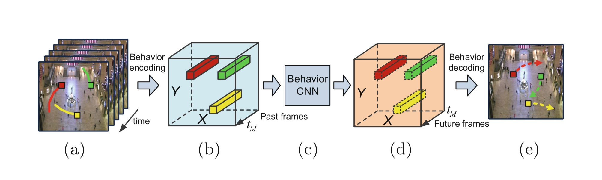
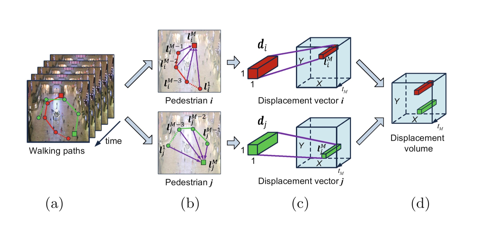
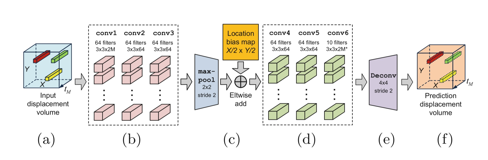
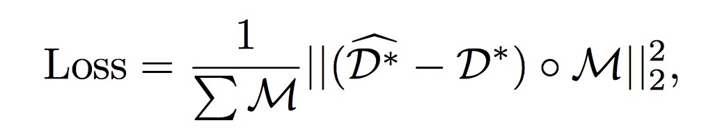
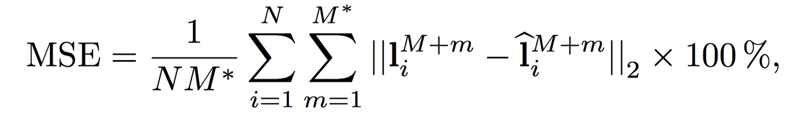
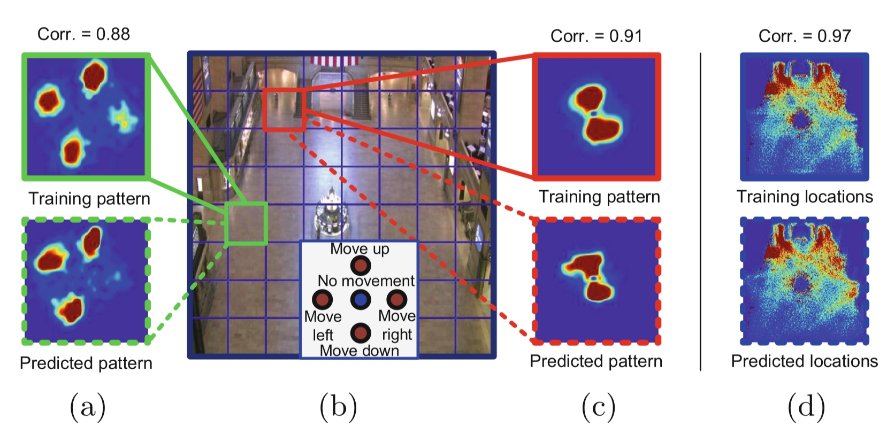
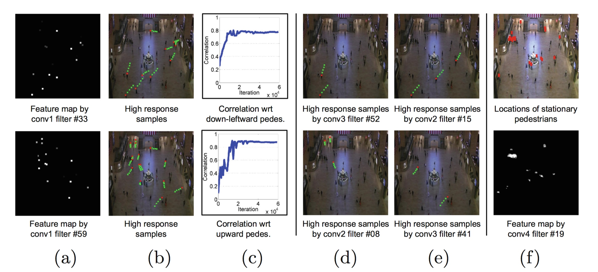
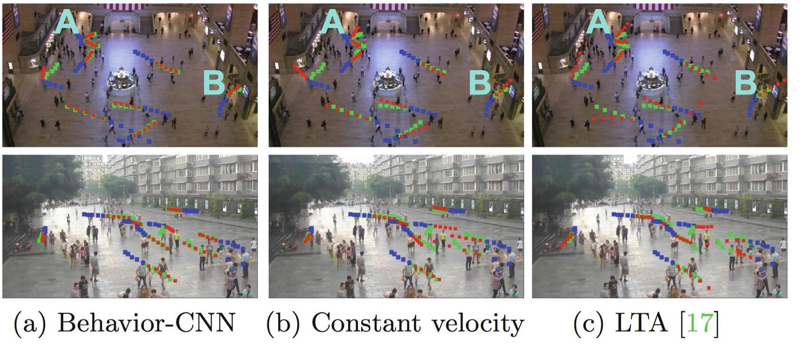
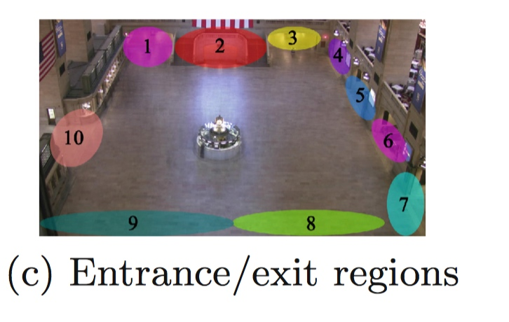

# [Pedestrian Behavior Understanding and Prediction with Deep Neural Networks](https://link.springer.com/chapter/10.1007/978-3-319-46448-0_16)
1. 论文发表在ECCV2016，使用深层神经网络理解并预测行人运动行为。(一作：Shuai Yi)

2. 论文的核心思想：通过一种编码方案(encoding scheme)，使得行人的运动轨迹适合作为CNN的输入与输出。

3. 论文的贡献：

    > 1. 用深层卷积网络(deep-CNN)建模了行人长期运动行为(Long-term pedestrian behaviors)，并对得到的CNN的结构进行了分析。

    > 2. 提出了一个行人运动行为的编码方案(pedestrian behavior encoding scheme), 将行人的运动路径编码为“稀疏位移量”(sparse displacement volumes)。后者可以直接作为深层网络的输入和输出。
 
4. 论文的方法：

上图所示为总体的框架: 

    >系统的输入为前几帧行人运动轨迹(图a 中的带颜色曲线)；然后将它们编码 为位移量(displacement volume)，如图 b 所示；将编码之后的量输入到Behavior CNN 中，网络的输出也为displacement volume，然后通过解码操作得到未来的预测估计。

* 运动轨迹编码：

如上图所示为编码过程。

    > 令 $p_1,p_2,...,p_N$代表场景中的$N$个行人, $t_1,t_2,...,t_m$代表$m$ 个时刻，其中$t_m$代表当前时刻。在时刻$t_m$，行人 $p_i(i\in[1,N])$ 的归一化空间位置记为$l_i^m=[x^m_i/X, y^m_i/Y]$。其中，$x_i^m\in[1,X]$, $y_i^m\in[1,Y]$ 为空间坐标，$[X,Y]$ 为输入帧的空间大小(spatial size)。所有的位置都是基于网格的。
  
    > 使用一个 $2M$ 维的位移向量$d_i=[l_i^M-l^1_i ,l^M_i-   l_i^2,...,l_i^M-l_i^{M-1},l_i^M-l_i^M]$ 表示之前$M$帧，行人 $p_i$ 的轨迹信息。$d_i \in (-1,1)$.
    
    > 基于$d_i$构建一个三维的位移量tensor $D\in R^{X\times Y\times 2M}$。对于每一个行人 $p_i$ ，若其当前所在时刻的位置$(x_i^M, y_i^M)$，则令 $D(x_i^M,y_i^M,:) = d_i$。为了区分含有静止行人和没有行人的位置(格子)，对所有含有行人的位置的 $d_i+\textbf{1}^T$。即 $D(x_i^M, y_i^M,:)=d_i+ \textbf{1}^T$。此时，含有人的格子，其$2M$个向量元素取值范围 $\in(0,2)$, 静止行人为 1 ，$D$ 中的其余部分均设置为 0。
    
* CNN 模型

    >1. CNN 的输入为$D\in R^{X\times Y \times 2M}$，输出为 $D^* \in R^{X\times Y \times 2M^*}$.

    >2. 经过前三个卷积层操作之后的输出大小为 $X\times Y \times 64$。(为了保证feather map 的大小不变，中间有zero pad 操作)

    >3. 经过max-pool 操作之后(stride 为2)，输出大小为$X/2 \times Y/2 \times 64$。

    >4. 设置一个可学习的位置偏差图(location bias map)，其大小为$X/2 \times Y/2$。然后将这个位置偏差图 channel-wisely (总共有64个channel)加到 pool 之后得到的feather map 上。这样，每一个位置都有一个独立的偏差值(bias)，这个值在相同位置的所有通道上共享。 这个 location bias map 表示了环境信息。

    >5. 之后是三个卷基层，再接着是一个逆卷积层，得到$D^*$.

* 损失函数和训练：
损失函数计算预测得到的位移量和实际的位移量的$L_2$范数平方，定义为： 

其中， $\hat{D^*}$ 代表预测得到的位移量(displacement volume)；$D^*$ 代表 ground-truth 的位移量。中间的点乘代表Hadamard product(哈达玛积，矩阵中对应元素相乘),$M$ 是一个binary mask，当$D^*$为0 时，$M=0$。( $D^*$ 为 0 的 entry 代表在时刻$t_m$，该位置没有行人)

    由于输入数据非常稀疏，网络很容易陷入局部极小值，因此，文章采用了分层训练的方式。首先，训练一个随机初始化的三层卷积网络直到收敛，然后将这三层网络作为模型的$conv1$、$conv2$、$conv3$。之后加入后面的网络，联合训练。
 
*  实验结果：
采用MSE准侧函数来衡量预测结果。(文章在实现中，设置$X=Y=256$，而且文章没有提到对数据的预处理).
对预测的$M^*$个时刻，计算预测出来的归一化位置和归一化的ground-truth之间的$L_2$距离。

上式中: $\hat{l}_i^{M+m}=[x_i^{M+m}/x, y_i^{M+m}/y]$是归一化的位置。

* Investigations on Behavior-CNN 对模型的一些实验解释
    文章试验了有或者没有 Location bias map 对预测结果的影响。以及环境信息是否对网络预测结果有影响。
    
上图中的实例说明，论文提出的网络结构能够学习到位置信息以及环境信息。(a~c)说明了网络能够捕获不同区域不同的运动模式.

    下图展示了不同的滤波器学到的内容：
    
    图(a)分布表示第一个卷积层的33、59号滤波器得到的feather map。图(b)所示为图(a)上的高响应点的轨迹。(红点代表当前位置),可以看到filter 33能够找出向下移动的行人，而filter 59可以识别向上移动的行人。层数越高的滤波器越能更好的识别某一类轨迹的行人。(图d、图e) 
对于高层次的卷积(conv4~conv6)，越能捕获复杂的运动模式。上图(f)表示第四层的filter 19能够捕获静止的行人。
论文还讨论不同的网络结构对预测结果的影响。尤其是感受野(Receptive Fields，表明了考虑与当前行人多元范围内的行人，论文使用的是场景大小的10%)的大小对性能的影响（所以，本文的模型使用了pool层，通过pool层，使得在网络参数个数相同时，感受野为2倍）。

* 结果展示：

上图中，绿色是ground-truth,红色是预测出来的。蓝色是走过的。
* 应用：

     1. 行人运动目的地预测。
    

     2. 作为先验知识提高Tracking算法的效果。

