# [Understanding Pedestrian Behaviors from Stationary Crowd Groups](https://www.cv-foundation.org/openaccess/content_cvpr_2015/papers/Yi_Understanding_Pedestrian_Behaviors_2015_CVPR_paper.pdf)
1. 论文发表在CVPR2015上（一作:Shuai Yi）。

2. 论文的主要工作是：建立了一个行人运动(pedestrian behavior)的模型，其中，对静态人群是分析是关键部分。模型可以用来预测行人的轨迹；预测行人运动的终点；以及对人群中行人的运动行为分析。
3. 论文的方法：

    > 相关研究发现：静止的人群(stationary crowd groups)对行人运动的影响大于运动的人群(moving crowds)。(当运动的行人遇到运动的人群时, 行人一般只会减速，而当遇到静止的人群时，通常会改变方向)。
    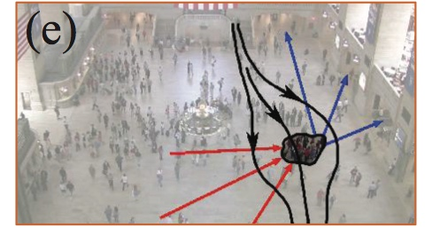
如上图所示：场景中的静止人群既可以作为（单个人）运动的终点和起点，也可以作为障碍物或者通道。
由于静止人群的位置分布(spatial distribution)可能随时间变化，因而引入了动态特征(dynamic variations of traffic patterns)。而且当行人遇到静止人群时，即可能绕开人群，也可能穿过人群。论文建模了这些情况。

* Pedestrian Behavior Modeling
    
    > 行人通常会选择最方便、最有效的路径到达目的地。文章提出了一个“通用场景能量图”(general scene energy map), 来表示场景中不同位置的travel difficulty。能量越高的地方表示行人越愿意经过这些地方，因而，在能量高的地方观测到行人的概率也越大。
    
* 通用能量图建模(General energy map modeling)

    > 通用能量图从三个方面来建模：1. 场景布局 $f_{SL}$；2.移动的行人$f_{MP}$; 3. 静止的人群 $f_{SG}$。
    > 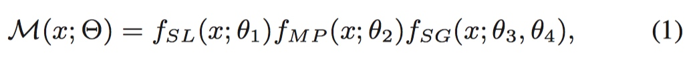
其中，$\theta_1,\theta_2,\theta_3,\theta_4$不同项的权值向量。各项的表达式如下所示：

    #####1.场景因素：
    >  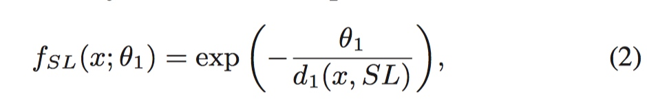 
    > 一般情况下，越是离障碍物近的地方，行人越不可能去。
上式中，$SL$代表障碍物占据的位置，$d_1(x,SL)=min_{y\in{SL}}\parallel x-y \parallel_2^2$ 衡量当前位置$x$与最近的障碍物距离。$x$ 越靠近障碍物，$f_{SL}$的值越小。

    #####2.移动行人的影响：
    > 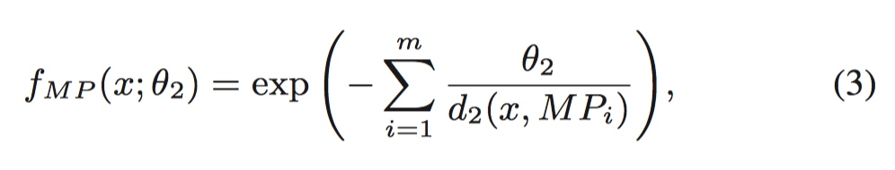
行人总是与其他行人保持一定的距离，因此，行人周围地点的能量值较低。
上式中，$MP_i$ 代表第$i$个移动的行人，$x_t^{MP_i}$是$MP_i$在当前时刻$t$的位置，$x_{t+1}^{MP_i}$是估计出来$t+1$时刻的位置。$d_2(x,MP_i)=(\parallel x-x^{MP_i}_t\parallel +\parallel x-x^{MP_i}_{t+1} \parallel )^2 - (\parallel x_t^{MP_i} - x_{t+1}^{MP_i}\parallel)^2$,衡量当前位置$x$到移动的行人$MP_i$的距离。(这个距离度量来自social-force model)。

    #####3.静止人群的影响：
    对于绕过人群的行人来说，静止的人群可以视为障碍物(等同于场景因素)；对于穿过人群的行人，需要根据人群的密度不同，设置不同的罚项。
    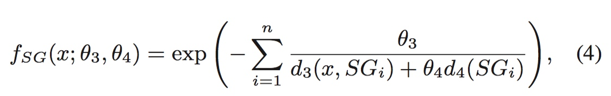
其中，$SG_i$是第$i$个静止的人群区域。$d_3(x,SG_i)=min_{y\in{SG_i}}\parallel x-y \parallel^2_2$衡量$x$到$SG_i$区域的距离。$d_4(SG_i)$衡量人群 $SG_i$ 的稀疏性($d_4$计算人群中行人之间的平均距离)。当$x\in SG_i$时，$d_3(x,SG_i)=0$.

* 个性化能量图(Personalized energy map modeling)
 在相同的环境下，不同的行人也可能有不同的走法，通过设置一个个性化因子$P$来建模.
 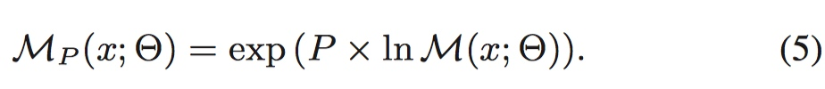
若$P$值较大，则对于这个人来说，通用能量图中的所有因子$\theta_1,\theta_2,\theta_3$将同比例增大，此时，障碍物、行人、静止的人群周围的能量值都将下降，因而，此行人将走更远的路，来避免接触到这些障碍物。而当$P$值较小时，此人较少关注这些障碍物(walking aggressively and cares less about obstacles.)

* 路径生成的过程
给定起始点$x_s$和终点$s_d$，可以基于能量图M(或者个性化能量图$M_P$)，通过Fast Marching算法得到最优路径。
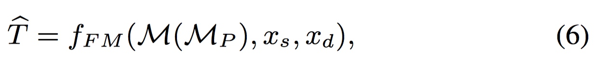
此时得到的$\hat{T}$是当前能量图下最可能、最有效的路线。
* 模型的学习
能量图中某一点的能量表示了在这点观察到行人的概率。因此，模型的参数可以通过最大化似然函数得到。通过一个归一化项$Z(\theta)$，得到：
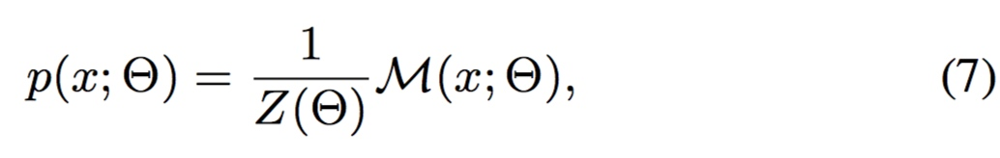
其中，$Z(\theta)= \int M(x;\theta)dx$。
对于给定的K个观测点$x_1,x_2,...,x_k$，观测到序列$X=\{x_1,x_2,...,x_k\}$ 的似然函数为：
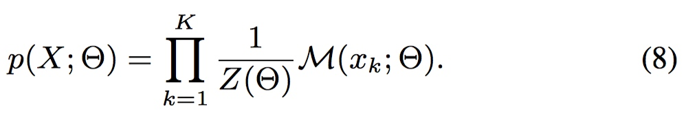
因而参数$\theta$可以通过下式得到：
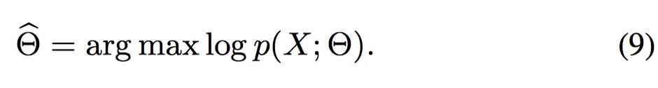
通过梯度下降法迭代更新参数：
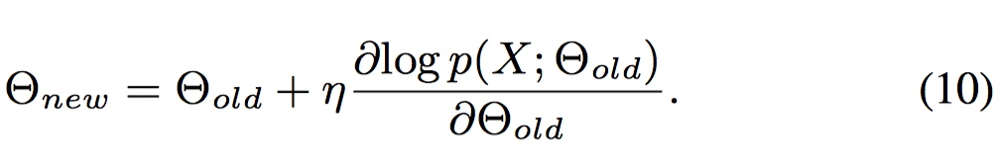
* 行人的路线预测：
定义一个over-cost值 $\eta$ 来衡量预测结果和ground-truth的匹配程度。
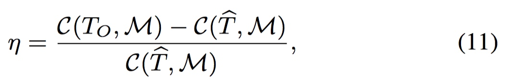
上式中$C(T_O,M)$是基于当前能量图,由实际观测到的路线产生的cost。而$C(\hat{T},M)$是基于最优路线$\hat{T}$产生的花费。由于$C(T_O,M) > C(\hat{T},M)$。因而$\eta$越小，表示匹配的越好。
结果：
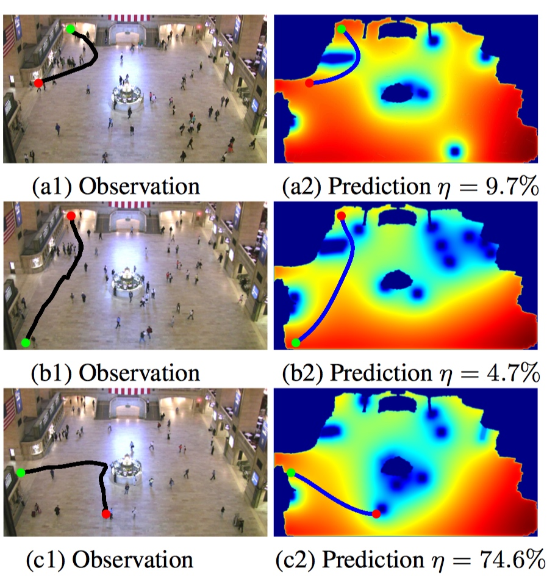
* 行人运动终点预测：
给定起点$x_s$和部分轨迹$T$，可以预测终点位置：
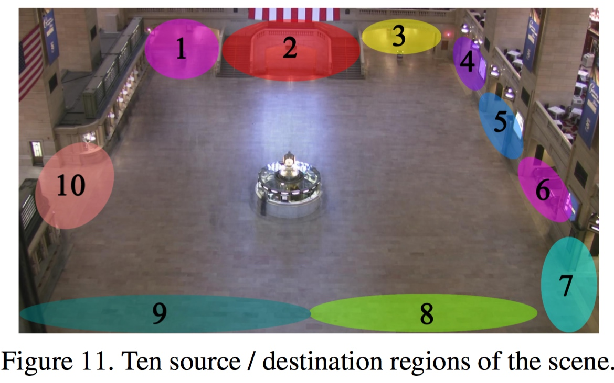
方法是：输入起点和前半部分轨迹，对于10个终点位置$S_i$，计算
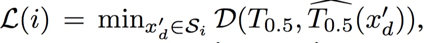
其中，$\hat{T_{0.5}}(x_d')$是$\hat{T}(x_d')$的前半部分，而$\hat{T}(x_d')=f_{FM}(M, x_s, x_d')$表示从$x_s$出发到$x_d'$的最优路线，$D(·,·)$表示两条轨迹之间的距离，
top_n 的预测结果如下：
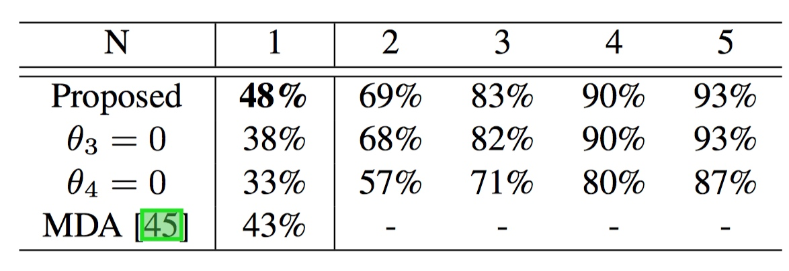

原文中还包括对$P$值的探讨，以及通过$P$值将人群分类(方法还是通过最小化预测轨迹和观测轨迹的差距)。这里不再介绍。

