# [Who are you with and Where are you going?](http://vision.is.tohoku.ac.jp/~kyamagu/papers/yamaguchi_cvpr2011.pdf)
* 论文发表在CVPR2011上,引用次数219次。

* 本文的贡献在于建立了一个能量函数，将各种影响行人运动的因素(personal、social、environment)综合考虑。明确的考虑了可能影响行人运动的隐含变量(hidden factors): 1. desired grouping behavior(who a person is trying to walk with); 2. the pedestrian's desired destination. 并且通过data-driven的方式估计隐含变量。

* 能够有效估计行人运动的终点，以及行人之间的social relationships(groups).

## Behavioral model
### An energy function for pedestrian navigation:
The energy function for every pedestrian expresses the desirability of possible directions of motion for the pedestrian.

在每个时刻 $t$, 第 $i$ 个行人的状态表示为 $s_i^{(t)}=(p_i^{(t)}, v_i^{(t)}, u_i^{(t)}, z_i^{(t)}, A_i^{(t)})$. 前四个变量依次表示：位置、速度(矢量)、preferred speed(标量), 终点。$A_i$表示包括 $i$ 在内的一个social group中的所有行人. 由于$u_i^{(t)}$, $z_i^{(t)}$, $A_i$都是不可观测的，将这三个变量视为常量(time-invariant)。与[You'll never walk alone (ICCV09)](http://vision.cse.psu.edu/courses/Tracking/vlpr12/PellegriniNeverWalkAlone.pdf) 中相同,模型预测下一个时刻的速度$v_i^{(t+\Delta t)}$.

能量函数定义如下：
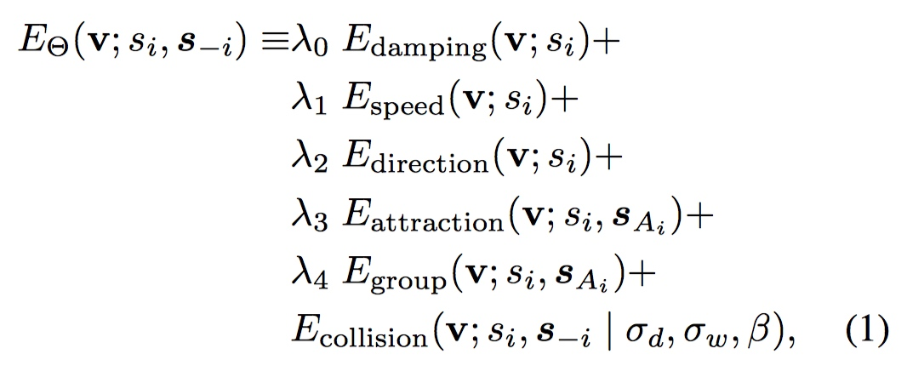
其中，$\Theta = {\lambda_0,\lambda_1,\lambda_2,\lambda_3,\lambda_4,\sigma_d,\sigma_w,\beta}$ 为参数。$s_{A_i}$ 表示第 $i$ 个行人的 social group中所有行人的状态集合。$s_{-i}$ 表示其他人的状态集合。

1. 阻力项 (Damping): 惩罚速度的突变,  $$E_{damping}(v; s_i) = |v - v_i|^2$$
2. 速率项 (Speed): 惩罚速率偏离 preferred speed $u_i$, $$E_{speed}(v; s_i) = (u_i - |v|)^2$$
3. 方向项 (Direction): 通过$-cos$函数控制行人的速度方向朝向目的地 $z_i$， $$E_{direction}(v;s_i) = -\frac{z_i-p_i}{|z_i-p_i|} \cdot \frac{v}{|v|}$$
4. 人群之间的吸引 (Attractin): People in the same group tend to stay close to each other while moving together. 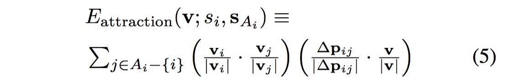

    上式中，$\Delta p_{ij} = p_i - p_j $。第二项惩罚 $v$ 的方向远 离第$j$个行人。第一项考虑$v_i$和$v_j$此时的夹角。

5. Grouping: 同一个group里的人倾向于以相似的速度和方向移动，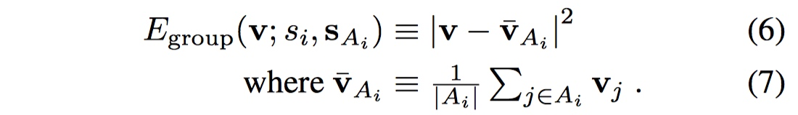

6. 避免碰撞，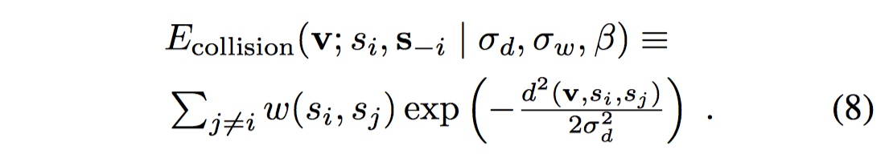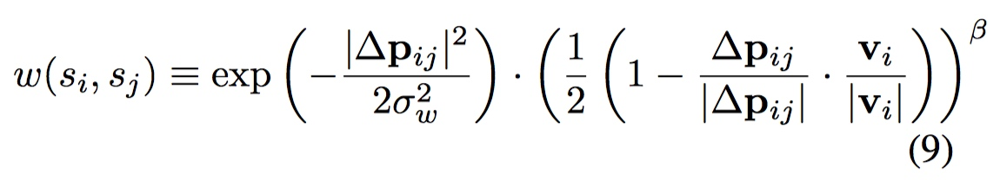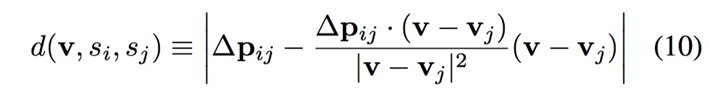

   这一项是直接从You'll never walk alone中拿过来的。
    
###Dynamic model
第$i$个行人从 $t$ 到 $t+\Delta t$ 的状态转移为：
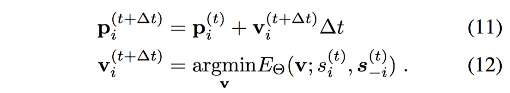
在训练过程中，当对一个行人的行为预测时，保持其他人的状态为ground-truth。用 $\tilde{s_i}$ 表示ground-truth。学习的过程为：
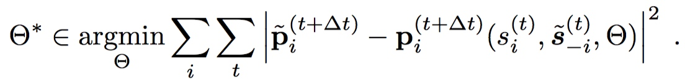
模型中包含三个不可观测的量。分别是: preferred speed、destination、social groups.
其中：
1. 设置preferred speed 为之前所有时刻的平均速度。
2. 将 $K$ 个可能的目的地表示为：${Z_1,Z_2,Z_3,...,Z_K}$, 行人 $i$ 之前的状态信息表示为: $r_i^{(t)}=\{s_i^{(t')}\}_{t'\leq t}$, 通过一个特征函数$f_{dest}(r_i^{(t)})$表示状态信息，用一个线性SVM预测可能的目的地。$$\check{z_i}^{(t)} = C_{dest} (f_{dest}(r_i^{(t)}))$$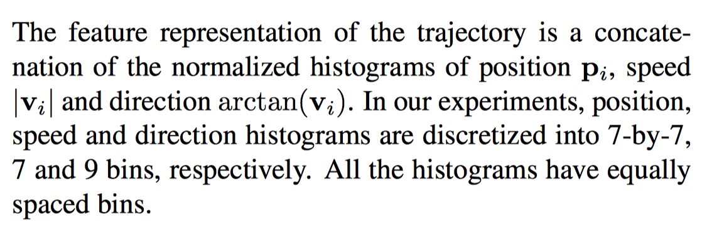
3. 需要预测两个行人 $i$ 和 $j$ 是否属于同一个group。 给定两个行人之前的状态$(r_i^{(t)},r_j^{(t)})$, 判断他们是否属于同一个group($y_{ij}\in \{+1,-1\}$).通过一个SVM分类器来解决这个二分类问题。$$\tilde{y}_{ij}=C_{group}(f_{group}(r_i^{(t)},r_j^{(t)}))$$ $f_{group}$表示feature function.预测出来的social group为：$$\tilde{A_i}=\{j|\check{y}_{ij}=\pm1,j\neq i\}\cup\{i\}$$ 特征表示的方法如下：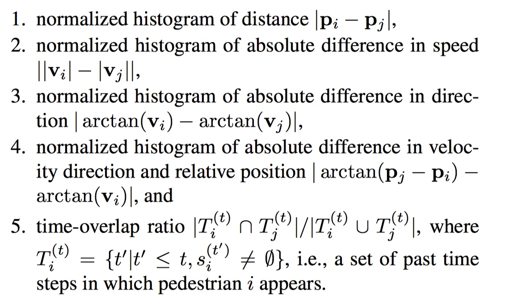
### Evaluation
实验首先评估了预测目的地、Social group的精度、查准率、查全率。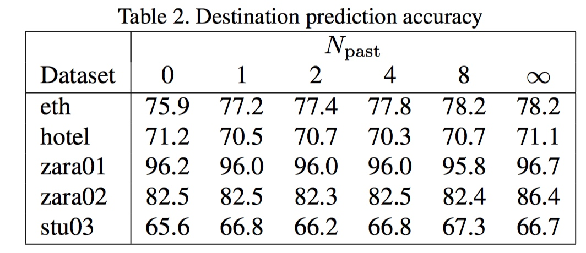
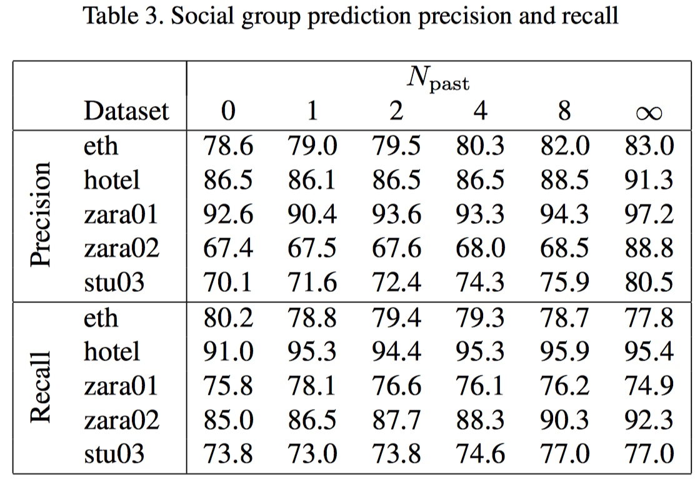
$N_{past}$表示考虑过去多少步的状态信息。结论：目的地的预测十分依赖于场景，而$N_{past}$基本不影响。而social-group的预测需要$N_{past}$的信息。
然后实验验证了，预测出来的行人位置与groud-truth之间的平均位移。预测的结果如下：
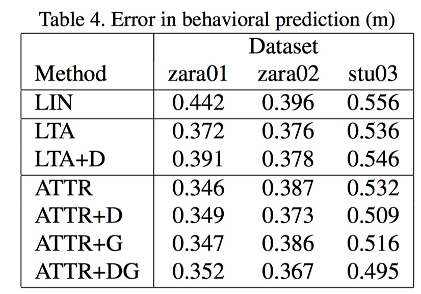
上图中, LIN代表恒定速度模型，LTA 代表You'll never walk alone 中的模型(目的地为ground-truth)。LTA+D 表示与LTA 相同的模型，但是目的地是预测出来的。ATTR代表本文的模型(目的地和social group 为ground-truth)，ATTR+D表示目的地是预测的，ATTR+G 表示Social-group 是预测出来的。ATTR+DG 表示完全用预测出来的。可以看到ATTR+DG 比LTA 结果要好。

